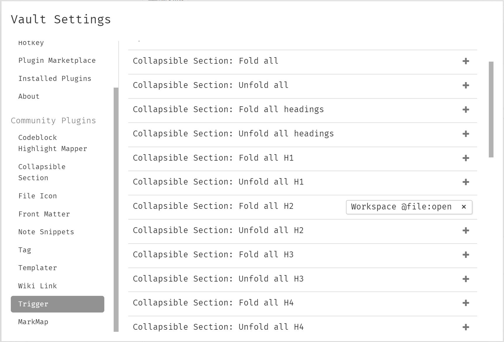

# Typora Plugin Trigger

This a plugin based on [typora-community-plugin](https://github.com/typora-community-plugin/typora-community-plugin) for [Typora](https://typora.io).

Set a trigger for the command to execute automatically.

## Preview

The above settings allow the automatic collapse of secondary headings when opening a file.
